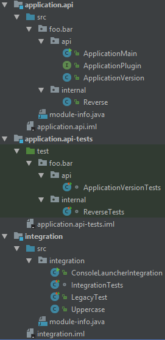

# junit5-idea-java9-consumer

The `junit5-idea-java9-consumer` project demonstrates how to run tests based on
JUnit Platform standalone distribution using IDEA in the a modular environment.

This sample project does not aim to demonstrate how to use the JUnit Jupiter APIs.
For detailed  information on the JUnit Jupiter programming and extension models,
please consult the [User Guide](http://junit.org/junit5/docs/current/user-guide/).

## overview

Project | Description
--------|------------
 | This project hosts 2 (two) **Java modules**:
 |
 | - `application.api`
 | - `integration`
 |
 | and a single **IDEA module** without a `module-info.java` file:
 |
 | - `application.api-tests`

## known issues

- When launching *Run 'All Test'* in `integration` service loading does not work.
- Instead of using `--scan-classpath --classpath ... --classpath ...` command
  line options, the JUnit Platform ConsoleLauncher should support something like:
  `--scan-modulepath`
- Forwarding `integration.ConsoleLauncherIntegration` wrapper should not be
  necessary.